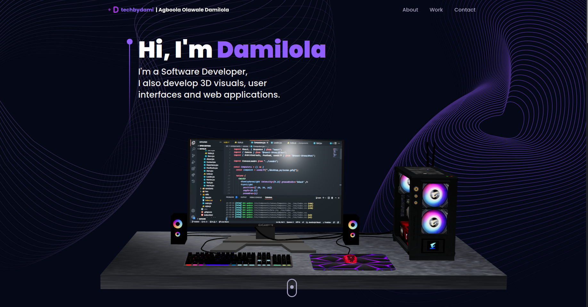

## :notebook_with_decorative_cover: Overview

### Build and Deploy a 3D Portfolio Website with Three.js and React.js. This repository houses an well-designed and functional Developer Portfolio Website consisting Navbar, Hero, Overview, Work Experience, Technologies, Projects, Testimonials and Contact sections.



## :star2: Introduction

### The most impressive websites in the world use 3D graphics and animations to bring their content to life. Learn how to build your own ThreeJS 3D Developer Portfolio today!

### Stack used:

### :space_invader: Tech Stack

[](https://skillicons.dev)

- ThreeJS, a robust 3D graphics library renowned for rendering and animating three-dimensional models.
- React Three Fiber, a widely embraced library that seamlessly integrates ThreeJS into React for 3D graphic development.
- TailwindCSS, a highly popular utility-first CSS styling framework.
- Framer Motion, the leading library employed to infuse animations into your React websites, bringing them to life.

### During the cause of building this project, you'll gain proficiency in the following:

- Loading, generating, and customizing captivating 3D models and geometries, while mastering the manipulation of lighting. Additionally, you'll grasp the intricacies of navigating the 3D environment through camera operations and precise object positioning.
- Elevating your codebase to greater levels of reusability and scalability by leveraging techniques such as Higher Order Components (HOCs) and adhering to industry-standard best practices.
- Implementing a feature for sending emails via a website form using EmailJS.
- Ensuring your website's responsiveness across a spectrum of devices and optimizing its performance through strategies like Suspense and Preload.

## :toolbox: Getting Started

<!-- Installation -->

### :gear: Installation

#### Step 1:

Download or clone this repo by using the link below:

```bash
 https://github.com/TechByDami/3D_portfolio.git
```

#### Step 2:

3D-Portfolio using NPM (Node Package Manager), therefore, make sure that Node.js is installed by execute the following command in console:

```bash
  node -v
```

#### Step 3:

At the main folder execute the following command in console to get the required dependencies:

```bash
  npm install --legacy-peer-deps
```

#### Step 4:

At the main folder execute the following command in console to creates a build directory with a production build of 3d portfolio:

```bash
  npm run build
```

#### Step 5:

At the main folder execute the following command in console to run the server:

```bash
  npm run start
```

<!-- Run Locally -->

### :running: Run Locally

#### Step 1:

At the main folder execute the following command in console to get the required dependencies:

```bash
  npm install --legacy-peer-deps
```

#### Step 2:

At the main folder execute the following command in console to run the development server:

```bash
  npm run dev
```

## :warning: License

Distributed under the MIT License. See [LICENSE.txt](https://github.com/TechByDami/3D_portfolio/blob/main/LICENSE) for more information.

<!-- Acknowledgments -->

## :gem: Acknowledgements

This section used to mention useful resources and libraries that used in 3D Portfolio

- [Email JS](https://www.emailjs.com/)
- [Framer Motion](https://www.framer.com/motion/)
- [React Tilt](https://www.npmjs.com/package/react-tilt)
- [React Vertical Timeline Component](https://www.npmjs.com/package/react-vertical-timeline-component)
- #JSMastery

---

### :handshake: Connect with me:

<p align="left">
<a href="https://twitter.com/techbydami" target="blank"></a>
<a href="https://linkedin.com/in/agboola-olawale-damilola-7b2132246" target="blank"></a>
<a href="https://stackoverflow.com/users/19747131" target="blank"></a>
<a href="https://instagram.com/techbydami" target="blank"></a>
<a href="https://hashnode.com/@techbydami" target="blank"></a>
<a href="https://www.youtube.com/c/techbydami" target="blank"></a>
<a href="https://discord.gg/5007" target="blank"></a>
</p>
